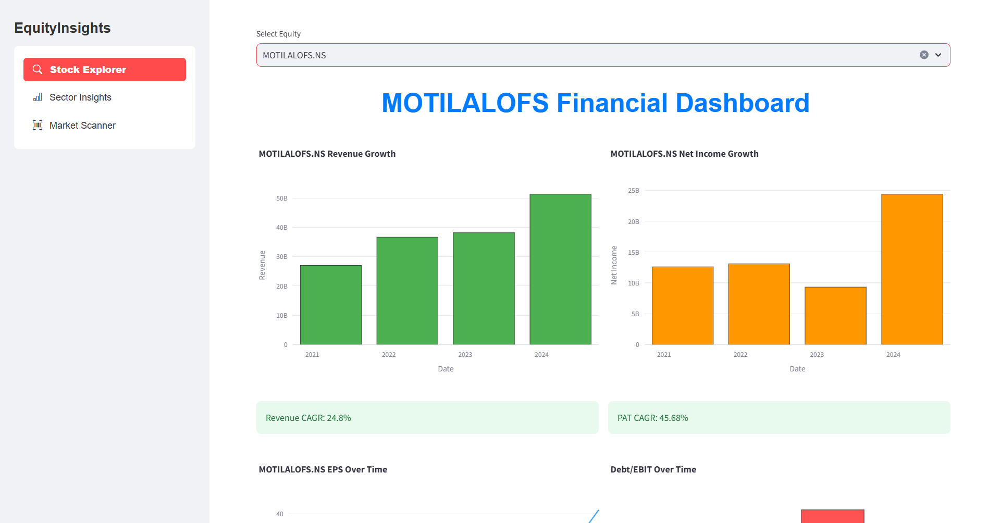
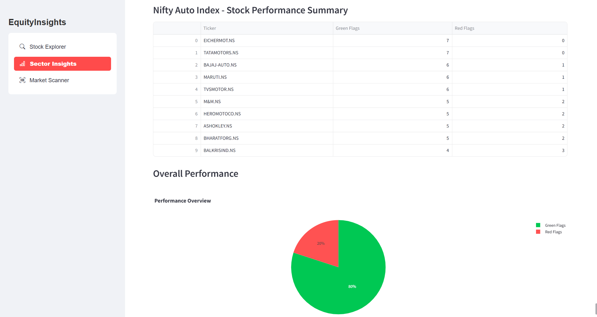
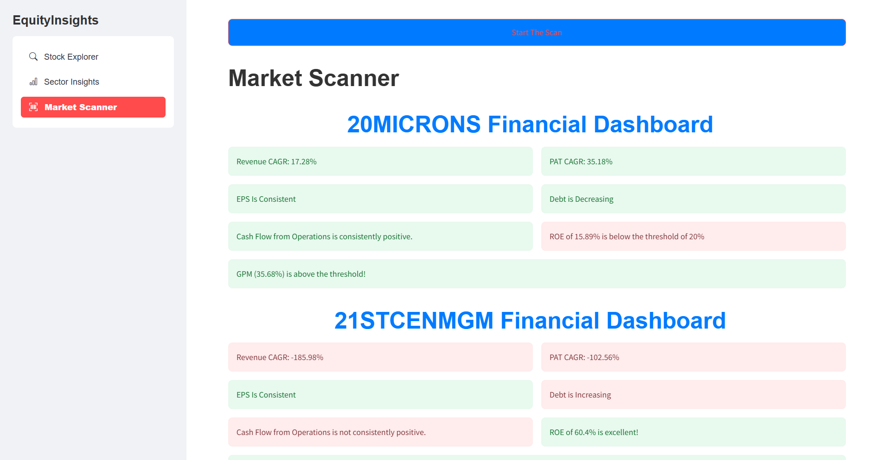

# **Financial Screener - A Streamlit Application**

## **Overview**
The **Financial Screener** is a Streamlit application that evaluates stocks based on fundamental analysis principles taught in the [Zerodha Varsity: Fundamental Analysis Module](https://zerodha.com/varsity/module/fundamental-analysis). It simplifies stock screening by automating the analysis of key financial metrics, helping users identify stocks with strong fundamentals.

---

## **Disclaimer**
This application is designed **solely for educational purposes**. It enables users to understand how fundamental analysis is performed and provides insights into the financial health of companies based on predefined criteria. 

⚠️ **This tool is NOT intended for investment decisions.**  
The Financial Screener is an educational tool that uses publicly available data to demonstrate the process of stock screening. Users are strongly advised to:
- Perform their own due diligence before making any financial decisions.
- Consult a certified financial advisor for investment guidance.

---

Here’s how the **Features** section can be updated with image references for each feature:

## **Features**

- **Stock Explorer**  
  Help to analyse a particular stock
  

- **Sector Insights**  
  Scans All the stock of a particular sector and give a Report about how the sector is performing
  

- **Market Scanner**  
  Screens Entire Stocks Market and help find Fundamentally Strong Stocks as per our Filters
  


---

## **How It Works**
1. Enter a stock ticker symbol (e.g., `AAPL` for Apple Inc.) in the sidebar input field.
2. The application fetches financial data using **yfinance** and applies the fundamental analysis criteria.
3. View detailed charts and summaries for each metric.
4. Explore the overall performance summary to understand the stock's potential based on its fundamentals.

---

## **Technologies Used**
- **Python**: Backend logic.
- **Streamlit**: Interactive dashboard creation.
- **yfinance**: Fetching real-time financial data.
- **Plotly**: Data visualization.

---

## **Usage Instructions**
1. Clone the repository and install dependencies:
   ```bash
   git clone https://github.com/Prem07a/FundamentalAnalysis.git
   cd FundamentalAnalysis
   pip install -r requirements.txt
   ```
2. Run the application:
   ```bash
   streamlit run app.py
   ```
3. Open the URL in your browser to access the dashboard.

---

## **Acknowledgements**
This project is inspired by the **Fundamental Analysis Module** from [Zerodha Varsity](https://zerodha.com/varsity/module/fundamental-analysis) and aims to simplify stock screening for educational purposes.

---

## License

This project is licensed under the MIT License. See the `LICENSE` file for details.